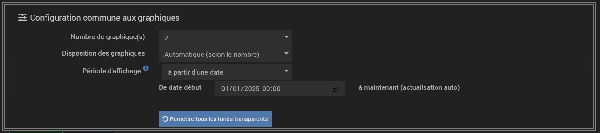
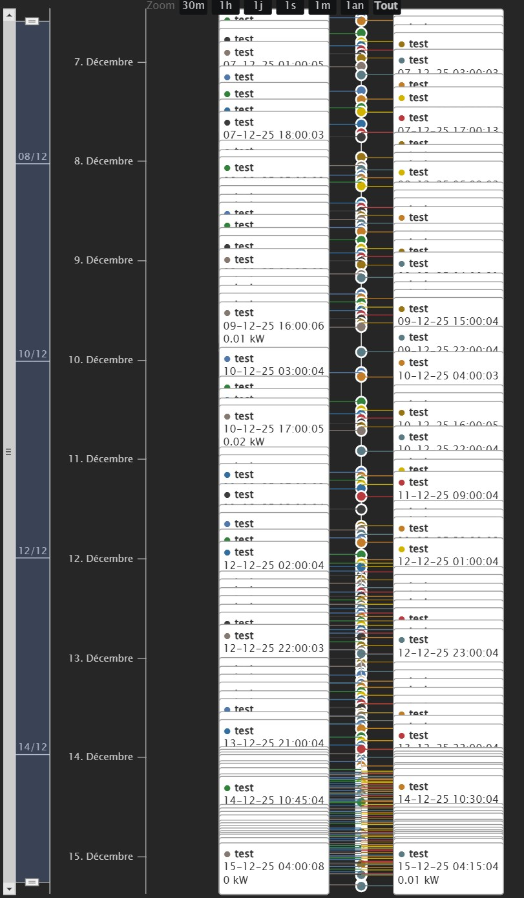
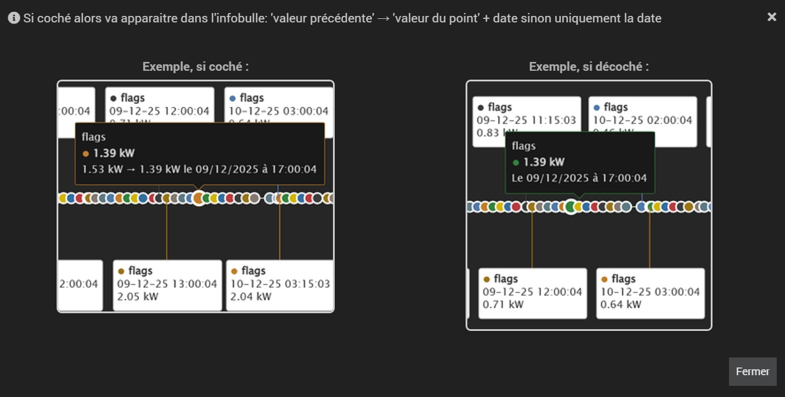
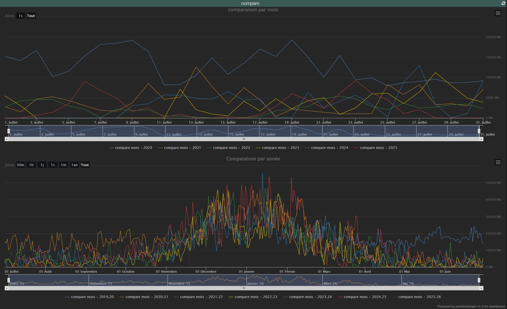
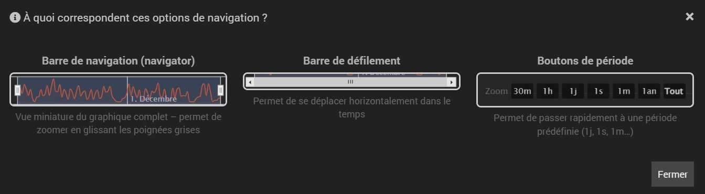

# Documentation du plugin jeeHistoGraph

## Présentation

Le plugin **jeeHistoGraph** permet de créer des graphiques historiques personnalisables directement dans Jeedom.

Un seul équipement peut afficher **jusqu’à 4 graphiques**, chacun contenant **jusqu’à 10 courbes**, avec une configuration fine de l’apparence, du comportement et de la période affichée.

---

## Création d’un équipement

1. Allez dans **Plugins → Monitoring → jeeHistoGraph**
2. Cliquez sur **Ajouter**
3. Donnez un nom à votre équipement (ex: "Conso Maison", "Production Solaire", etc.)

---

## Configuration commune

### Nombre de graphiques
Choisissez entre 1 et 4 graphiques à afficher.

### Disposition des graphiques
- **Automatique** : s'adapte selon le nombre. Tout l'espace pour 1 graphique, l'un au dessus de l'autre pour 2, 2 petits en haut 1 qui prend l'espace en bas si 3 et 2x2 pour 4.
- **1 colonne** / **1 ligne** / **2×2** / **2 colonnes** / **2 lignes**
- Dispositions spéciales :
  - `1 grand en haut + 2 petits en bas`
  - `2 petits en haut + 1 grand en bas`
  - `3 graphiques de taille identique → 2 en haut, 1 centré en bas`

### Période d’affichage globale
Définit la période par défaut pour tous les graphiques (peut être surchargée par graphique) :
- Nombre de jours (avec rafraîchissement automatique)
- À partir d’une date précise
- Entre deux dates
- Aujourd’hui / Cette semaine / Ce mois / Cette année / Toutes les données

---

## Configuration par graphique

Chaque graphique (1 à 4) possède ses propres paramètres disposés dans un onglet qui lui est propre :

### Titre et affichage
- Titre personnalisé
- Afficher/masquer le titre et la légende

### Type de courbe par défaut
- Ligne, courbe lisse, aire, colonne, etc.
  - particularité pour le type de courbe "ligne de temps": si ce type de courbe est selectionné il s'impose à toutes les courbes du graphique. Il dispose aussi de quelques paramètres en plus des autres type de courbe:
    - Nombre max de datas: le nombre de datas possibles à afficher par courbes est de 300 mais plus il y en a à afficher plus c'est gourmand en ressources c'est pourquoi vous pouvez définir le nombre de datas max par courbe
    - affichage vertical: par défaut l'affichage est horizontal mais vous pouvez le définir à vertical
    - affichage de tous les labels: si décoché seuls les labels qui ne se chevauchent pas seront affichés et si coché alors tous les labels apparaitront et se chevaucheront si manque de place
           
          
          
           
    - affichage de l'infobulle: si décoché, la bulle qui normalement s'ffiche au survol d'un point ne s'affichera plus
    - référence à la valeur précédente dans l'infobulle
           
          
                     
          
- Bouton : **Tout forcer au même type** pour les 10 courbes du graphique concerné

### RAZ couleurs courbes
- permet de remettre les couleurs par défaut de chaque courbe du graphique

### Afficher l'axe des Y (valeurs)
- permet de ne pas afficher l'axe des Y (axe vertical où sont affichés les valeurs pour un graphique standard)

### Fond du graphique
- Transparent (par défaut)
- Couleur unie
- Dégradé linéaire (couleur début/fin + angle)

### Période d'affichage
- Possibilité de surcharger la période globale pour ce graphique uniquement, dispose des mêmes que pour le paramètre global.

### Comparaison temporelle

Si une comparaison est choisie autre que "aucune" alors une seule courbe sera utilisée pour construire le graphique et les couleurs appliquées aux courbes seront celles par défaut de HighCharts

Cette option permet de pouvoir comparer les données pour une même courbe selon les choix suivants:
- Aucune: pas de comparaison, affichage normal d'une courbe
- Même mois des années précédentes: affiche le même mois de chaque année pour une courbe disposant de plusieurs années 
- Années précédentes idem que pour un mois mais sur une année entière avec choix du mois de départ des courbes (avec année glissante si mois de début défini)
           
          
                     

### Navigation
- type d'infobulle: affichage des infobulles au choix:
  - aucune infobulle
  - une infobulle par point: comportement normal d'HighCharts, affichage de l'infobulle au survol d'un point 
  - une seule infobulle par date commune: si plusieurs points ont une date commune alors affichage d'une seule infobulle qui regroupe l'ensemble des informations des courbes concernées
  - une infobulle par courbe par date commune: la même chose que ci dessus mais une infobulle par courbe s'affiche
- Barre de navigation (navigator)
- Barre de défilement (scrollbar)
- Boutons de période (30min, 1h, 1j, 1sem, 1mois, 1an, Tout)
           
          
               

---

## Configuration des courbes (10 par graphique)

Pour chaque courbe :

| Champ                 | Description |
|-----------------------|-----------|
| Libellé               | Si vide → la courbe n’est **pas affichée** |
| Commande              | Sélectionner une commande historisée (info numérique) |
| Type de courbe        | Hérite du graphique ou forcé (ligne, aire, colonne…) |
| Empilement            | Sélectionner le type d'empilement souhaité puis cocher les cases pour les courbes à y inclure |
| Affichage des données | Sélectionner une période de regroupement des données |
| Opération à appliquer | Sélectionner une opération à appliquer lorsque "affichage des données" n'est pas sur "Aucun" |
| Esc.                  | Si coché affiche la courbe en escalier. Ne fonctionne pas avec tous les types de courbe |
| Var.                  | Affichie les données en variation par rapport à la donnée précédente |
| Couleur               | Choix libre |
| Unité                 | Forcer une unité (ex: kWh au lieu de Wh) |
| Coefficient           | Multiplier la valeur (ex: ×0.001 pour passer de kWh → Wh). Possibilité de mettre des coefficient négatifs |

> Astuce : Bouton **"Remettre les couleurs par défaut"** par graphique

---

## Conseils d’utilisation

- Si besoin d'inverser les valeurs (négatives / positives) : utilisez un coefficient négatif (ex: -1)
- Pour comparer les années : activez la comparaison "années précédentes"
- Pour éviter les ralentissements sur de longues périodes : activez le **regroupement par jour/mois**

---

## Mise à jour en temps réel

Les courbes qui ne comportent pas de date de fin se mettent à jour automatiquement dès qu’une commande sélectionnée reçoit une nouvelle valeur (ex: teleinfo, onduleur, etc.).

---

## Dépannage

- Le graphique reste vide ? → Vérifiez que le **libellé de la courbe** est renseigné
- Trop de points → Activez un **regroupement** ou limitez la période
- Fond blanc bizarre ? → Cochez "Fond transparent" (recommandé sur thème sombre)

--- 

### Support & Contributions

développé par Noyax37 pour Jeedom.

- Forum Jeedom : https://community.jeedom.com/tag/plugin-jeehistograph
- Issues GitHub : https://github.com/Noyax-37/jeeHistoGraph/issues

Contributions bienvenues (améliorations, traductions, correctifs) !

Merci plus particulièrement à @Franck_jeedom et @jpty pour leurs retours et suggestions.

---